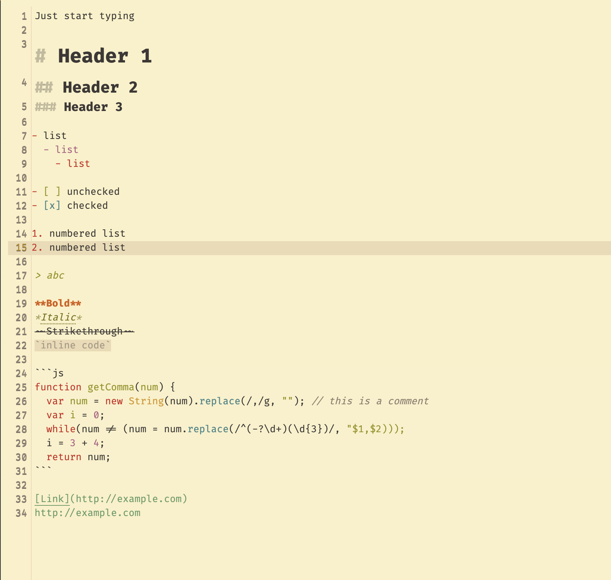
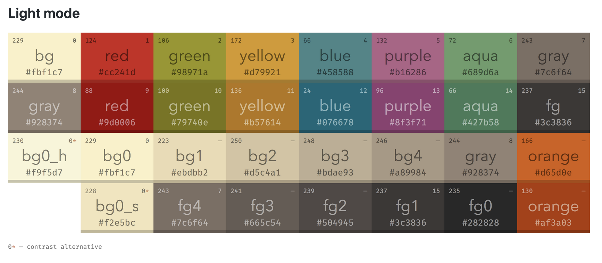

# inkdrop-gruvbox-light-syntax
gruvbox light syntax theme for Inkdrop Markdown Editor

Original gruvbox color scheme by Pavel Pertsev (https://github.com/morhetz/gruvbox)

## Install
`ipm install gruvbox-light-syntax`

## Screenshot

## Notes
- The color codes used are faithful to the codes from the original scheme below:

- This theme is forked from the [Inkdrop Gruvbox Dark syntax them](https://github.com/tdudz/inkdrop-gruvbox-dark-syntax) which is itself forked from the [Inkdrop Solarized Dark syntax theme](https://github.com/inkdropapp/inkdrop-solarized-dark-syntax-theme).

- It's possible that some components are not properly styled. Notice something wrong? Submit a GitHub issue or write me an email!
